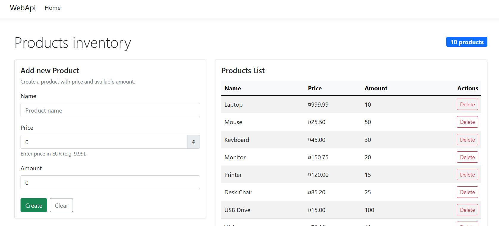
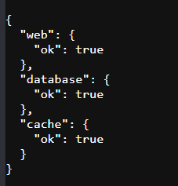
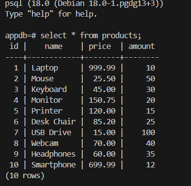
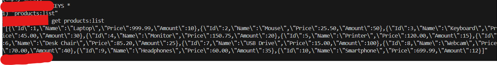
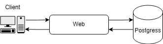
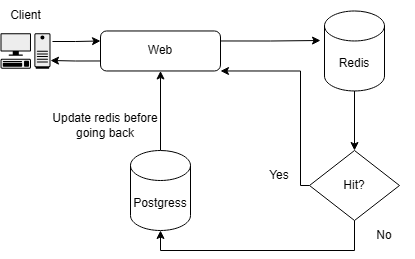

# XA-Practica1-2025
Practica 1 de Redes Avanzadas 2025 - Despliegue de aplicaciones multi-entorno

# Guía de instalación y ejecución
## Instalación
Para la instalación basta con hacer un git clone del repositorio https://github.com/AlejandroRodriguezB/XA-Practica1-2025.git y crear los archivos .env.dev y .env.pro en la raiz del proyecto con los campos siguentes y los valores que consideres:

```
POSTGRES_DB=<DbName>
POSTGRES_USER=<DbUser>
POSTGRES_PASSWORD=<DbPassword>
WEB_PORT=<PortValue>
```

## Ejecución
Primero levantar Pro/Dev (revisar apartado de MAKEFILE más abajo), una vez hecho revisar:

### Check web:
`http://localhost:<WEB_PORT>`



`http://localhost:<WEB_PORT>/status`




### Check postgres:
```
docker exec -it <id bd docker> psql -U <userBd> -d <nombreBd>

select * from products;
```



### Check Redis:
```
docker exec -it <id redis docker> redis-cli
KEYS *
get <PreviouslyObtainedKey>
```



>En caso de que se quiera ejecutar solo la web en local sin docker se tendría que descargar net8.0 y rellenar el archivo .config (tanto de dev como pro) con los mismos campos de los .env comentados previamente.

# Descripción de entornos
Hay dos entornos completamente independientes entre ellos:
 1. Production (pro): En el entorno de pro tenemos una web que conecta con una base de datos postgres y una cache redis la cual almacenará los contenidos devueltos por la base de datos durante 5 minutos o hasta que se vuelvan invalidos (insert o delete a postgres) para reducir las llamadas a base de datos. 
 2. Development (dev): Lo mismo pero sin la parte de la cache redis
# Diagrama de arquitectura del servicio

## DEV


> Cliente-> WEB -> Postgress  (y vuelta)
## PRO


>Cliente-> WEB -> Redis  (y vuelta si ya esta en cache) -> Postgress (y vuelta si ha llegado aqui actualizar cache))

# Resultado de pruebas y verificaciones

- [x] Deben crearse dos archivos de orquestación separados: docker-compose.dev.yml y dockercompose.prod.yml
- [X] Cada entorno debe disponer de su propio archivo .env con las variables de entorno
correspondientes (puertos, credenciales, etc.).
- [X] Los servicios deben ejecutarse sobre una red interna de Docker donde se comuniquen la aplicación, la base de datos y la caché.
- [X] Solo la aplicación web podrá exponerse al exterior a través de un puerto publicado; los demás servicios permanecerán accesibles únicamente desde la red interna.
- [X] Todos los contenedores deberán incluir un healthcheck configurado en el docker-compose.yml o en sus Dockerfile, que permita comprobar si el servicio está activo y respondiendo correctamente.
- [X] El estado de salud deberá verse reflejado en la aplicación web mediante su endpoint /status.
- El proyecto deberá implementar medidas básicas de seguridad:
    - [X] No incluir credenciales hardcodeadas en el código ni en los archivos YAML.
    - [X] Utilizar variables de entorno para contraseñas y configuración sensible.
    - [X] Evitar exponer puertos innecesarios.
    - [X] Aplicar permisos mínimos requeridos en los archivos de configuración.
    - [X] La automatización del despliegue es obligatoria.
- Se deberá incluir un Makefile o script bash (setup.sh, run.sh, etc.) que permita:
    - [X] Construir las imágenes
    - [X] Levantar el entorno (make up-dev, make up-prod)
    - [X] Detener y limpiar (make down)
- [X] La persistencia de datos deberá demostrarse insertando información en la base de datos, eliminando el contenedor y volviendo a iniciarlo, verificando que los datos se mantienen.

# Explicación de los healthchecks

En la web de cada entorno exponemos la url de /status la cual devuelve un json con el status de cada servicio (web, postgres y redis) y en el docker file hay un healthcheck que cada 30s ira escribiendo en consola el resultado de dicha pagina.

# Instrucciones de uso del Makefile

Ejecutar el comando: 

`make -f MAKEFILE <comando>`

Ejemplo de posibles comandos:

| Comando | Descripción |
|----------|--------------|
| `build-dev` | Construye las imágenes del entorno de desarrollo |
| `build-pro` | Construye las imágenes del entorno de producción |
| `up-dev` | Levanta el entorno de desarrollo |
| `up-pro` | Levanta el entorno de producción |
| `down-dev` | Detiene el entorno de desarrollo |
| `down-pro` | Detiene el entorno de producción |
| `clean-dev` | Detiene y elimina contenedores, imágenes y volúmenes del entorno de desarrollo |
| `clean-pro` | Detiene y elimina contenedores, imágenes y volúmenes del entorno de producción |